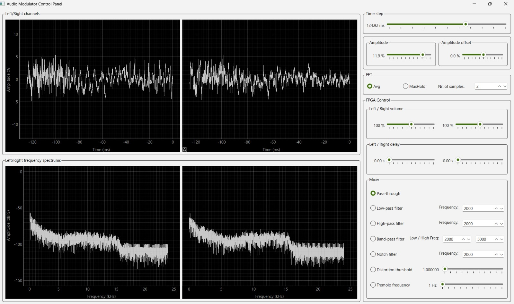
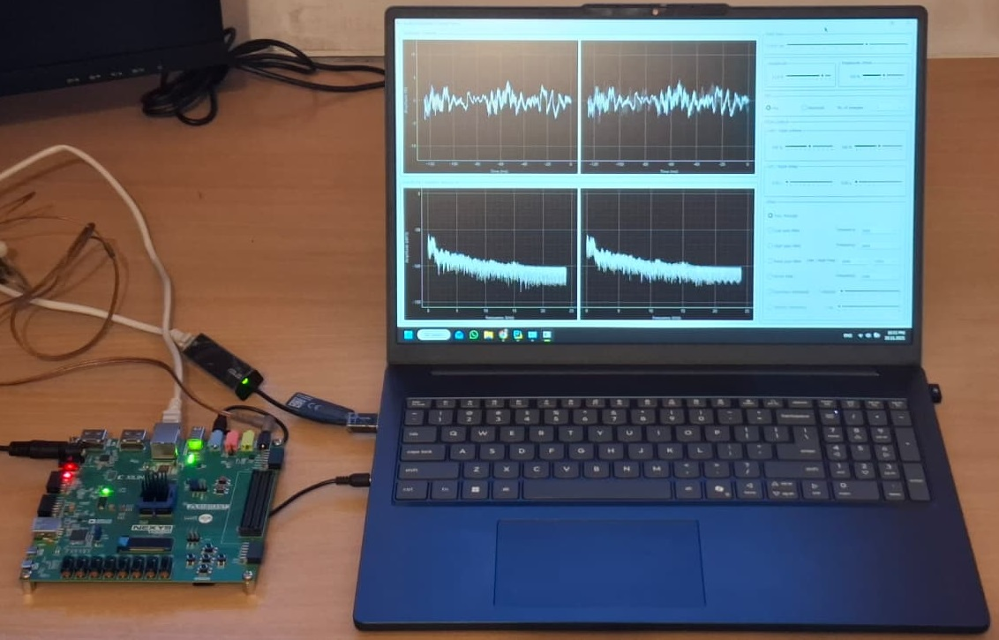

# Ethernet-Controlled Audio Modulator on Nexys Video

FPGA-based real-time audio effects processor with an Ethernet-controlled dashboard.

This project implements an audio modulation and filtering engine on a Xilinx Artix-7 FPGA (Nexys Video board). Audio comes in over a 3.5 mm AUX cable, is processed in hardware, and is sent back out to headphones or speakers, while a Python dashboard over Ethernet lets you monitor and adjust the processing in real time.

---

## Table of contents

- [Features](#features)
- [Hardware overview](#hardware-overview)
- [System architecture](#system-architecture)
- [Implemented audio effects](#implemented-audio-effects)
- [Dashboard](#dashboard)
- [Working setup](#working-setup)

---

## Features

- Real-time audio processing at 48 kHz
- All DSP implemented in Verilog on an Artix-7 XC7A200T FPGA
- Control over Ethernet using an external PHY and a custom protocol
- Python dashboard (PyQt6) with:
  - Time-domain and frequency-domain views (FFT) for both channels
  - Sliders and controls for all modulation parameters
- Per-channel controls:
  - Volume
  - Programmable delay (up to about 2.7 seconds) via FIFO buffers
- Effects and filters:
  - Low-pass, high-pass, band-pass, band-stop
  - Tremolo (amplitude modulation)
  - Hard clipping distortion
  - Pure pass-through

---

## Hardware overview

The project targets the **Digilent Nexys Video** board with the following key components:

- **FPGA:** Xilinx Artix-7 XC7A200T-1SBG484C  
- **Audio codec:** ADAU1761 (Analog Devices) – ADC/DAC and analog front-end  
- **Ethernet PHY:** Realtek RTL8211E-VL – Gigabit Ethernet transceiver  
- **Clocks:**
  - 100 MHz main clock
  - 25 MHz for Ethernet
  - 30.72 MHz, 3.072 MHz, 12.288 MHz and 48 kHz for the audio path

  

## System architecture

At a high level, the system connects an AUX audio source and a PC over Ethernet to the FPGA:

1. Audio in (line-level stereo via AUX) goes to the ADAU1761 codec.  
2. The ADC converts to 24-bit digital samples and sends them over I²S into the FPGA.  
3. The `audio_modulator` module processes samples: volume, delay, filtering, modulation, distortion.  
4. Processed samples go back over I²S to the codec, then to the DAC and out to the headphone/line outputs.  
5. In parallel, samples and status can be streamed over RGMII/Ethernet to the PC dashboard, and configuration packets from the PC update control registers inside the FPGA.

  

Inside the FPGA, the top-level design is roughly:

- **Clock generator block** – derives all required clocks from the 100 MHz input  
- **Audio modulator block**, containing:
  - I²S RX/TX  
  - Per-channel buffers and FIFO delays  
  - DSP blocks (filters, tremolo, distortion, mixer)
- **Audio codec configuration block** – configures the ADAU1761 via I²C at reset  
- **PHY configuration block** – configures the RTL8211E-VL via MDIO  
- **RGMII TX/RX blocks** – send and receive audio samples and control packets  
- **Register file** – holds all user-visible settings, updated from Ethernet frames
  

  

## Implemented audio effects

All filters are implemented as simple IIR structures in fixed-point arithmetic and are applied to time-multiplexed stereo channels to save FPGA resources. The filter coefficients are pre-computed on the PC and sent to the FPGA as fixed-point values.

  

### 1. Pass-through

- The input samples are routed directly to the output mixer with no modification.  
- Useful as a baseline for testing and comparison.

### 2. Low-pass filter

- Allows frequencies below a selectable cutoff through and attenuates higher frequencies.  
- Implemented as a first-order IIR, cascaded twice for a steeper slope.

  

### 3. High-pass filter

- Attenuates low frequencies and passes higher frequencies.  
- Also a first-order IIR, cascaded twice, with coefficients derived using a bilinear transform.

### 4. Band-pass filter

- Combines the high-pass and low-pass filters to select a frequency band.  
- Lower and upper cutoffs are independently configurable.

### 5. Band-stop (notch) filter

- Attenuates a narrow band around a center frequency while leaving the rest nearly unchanged.  
- Controlled by:
  - Center frequency  
  - Width parameter (e.g., *R* in the coefficient derivation)

### 6. Distortion (hard clipping)

- Clips the signal to ±threshold in the digital domain.  
- Any sample beyond the threshold is forced to the threshold value.  
- Simple but effective for adding harmonics and “overdrive” characteristics.

### 7. Tremolo (amplitude modulation)

- Multiplies the input by a low-frequency sine wave (0–1 amplitude), producing periodic volume variation.  
- Sine values are stored in a 1024-entry BRAM lookup table.  
- The modulation frequency is controlled by the LUT step size.

  

## Dashboard

The control dashboard is a Python application built with:

- Python 3.13  
- PyQt6 (GUI)  
- NumPy (signal processing and FFT)  
- Scapy (raw Ethernet packet I/O)

It runs two threads:

- **Ethernet I/O thread** – sends audio/control packets and receives processed samples  
- **GUI thread** – updates plots and widgets using data from a shared buffer  

The GUI displays:

- Time-domain waveforms (left and right channels)  
- Frequency spectra for each channel  
- Controls for:
  - Filter selection and cutoff frequencies  
  - Tremolo frequency  
  - Volume  
  - Per-channel delay  
  - Distortion threshold  
  - Any additional parameters exposed in the register file

  

## Working setup

  

